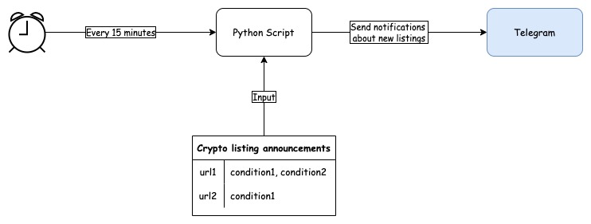

# Azure Crypto Listing Telegram Notifications Bot

## High-level flow

1. Bot is written as Python script.
2. Python script is executed every 15 minutes as Azure Function.
3. Bot takes a defined list of URLs with mapping of crypto market listing announcements to condition/s required to filter new listings info.
4. Bot sends a notification to the telegram group.
5. All supporting services are hosted in Azure.

